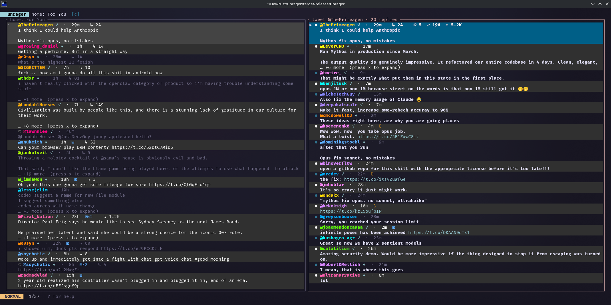
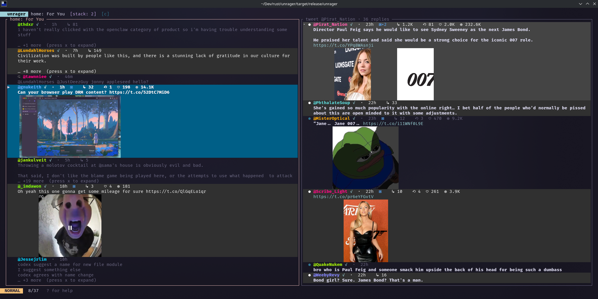

<p align="center">
  <h1 align="center">unrager</h1>
  <p align="center">
    A calm Twitter/X client for the terminal.<br>
    Local LLM drops rage-bait before it reaches your eyes.
  </p>
  <p align="center">
    <a href="https://github.com/guitaripod/unrager/actions"></a>
    <a href="LICENSE"></a>
    
  </p>
</p>

<p align="center">
  
</p>

## What is this

`unrager` is a Rust TUI + CLI for reading and posting on Twitter/X. It reads your timeline using the same GraphQL API the web client uses (free, no API key), posts via the official X API v2 (safe, pay-per-use), and — the whole point — pipes every incoming tweet through a local [Ollama](https://ollama.com) model that silently removes anything matching your rage-filter rubric before you ever see it.

```
unrager               # launches the TUI
unrager home -n 20    # one-shot CLI
unrager tweet "..."   # post via official API
```

## Quick start

```sh
# 1. Build
cargo install --path .

# 2. Launch (reads cookies from your logged-in browser automatically)
unrager

# 3. Optional: enable the rage filter
ollama pull gemma4
unrager   # filter is on by default when Ollama is reachable
```

## Features

### Rage filter

Every tweet classified by a local LLM against a user-editable rubric (`~/.config/unrager/filter.toml`). Matching tweets are physically removed from the feed — they never existed. Verdicts cache to SQLite so reloads are instant. Toggle with `c`. If Ollama is unreachable, the filter disables itself and everything shows normally.

### Inline media

Photos render inside the terminal via the [kitty graphics protocol](https://sw.kovidgoyal.net/kitty/graphics-protocol/) on Ghostty, Kitty, and WezTerm. Multiple images display side-by-side. Toggle with `I` for auto-expand or `x` per tweet. Falls back to colored `▣`/`▶`/`↻` badges on other terminals.

<p align="center">
  
</p>

### Split detail pane

`Enter`/`l` opens a tweet into a split view. Focal tweet + all replies in one scrollable list. Navigate with `j`/`k`, push deeper with `Enter` on a reply, pop back with `h`/`q`. `X` expands inline threads without leaving the current view.

<p align="center">
  
</p>

### Everything else

- Color-hashed `@handles` — FNV-1a hash → 20-color palette, deterministic and consistent across body mentions
- Zebra-striped rows, terminal-theme-aware body text (auto-detects light/dark via OSC 11)
- Word-wrapped cards, scroll look-ahead, compact timestamps (`2m`/`5h`/`3d`)
- Command palette (`:home`, `:user`, `:search`, `:mentions`, `:bookmarks`), history (`[`/`]`)
- Share tweets: `y` yanks a [fixupx](https://fixupx.com) embed URL to clipboard, `o` opens in browser
- Persistent session preferences, `?` help overlay with full key reference

<p align="center">
  
</p>

<details>
<summary><strong>Key bindings</strong></summary>

| Key | Action |
|---|---|
| `j` / `k` / `↓` / `↑` | Move selection |
| `g` / `G` | Top / bottom |
| `Ctrl-d` / `Ctrl-u` | Half-page down / up |
| `Enter` / `l` | Open tweet into detail pane |
| `h` / `←` | Back to source list |
| `q` / `Esc` | Pop detail or quit |
| `Tab` | Swap active pane |
| `,` / `.` | Narrow / widen split |
| `:` | Command palette |
| `?` | Help overlay |
| `F` | Toggle For You / Following |
| `c` | Toggle rage filter |
| `x` | Expand / collapse tweet body |
| `X` | Inline thread replies (detail pane) |
| `I` | Toggle media auto-expand |
| `M` | Toggle retweet / like / view counts |
| `N` | Toggle display names |
| `t` | Toggle relative / absolute timestamps |
| `o` | Open tweet in browser |
| `m` | Open media externally |
| `y` | Yank fixupx URL to clipboard |
| `Y` | Yank tweet JSON to clipboard |
| `r` | Reload source |
| `u` | Jump to next unread |
| `U` | Mark all as read |
| `]` / `[` | History forward / back |
| `Ctrl-c` | Quit immediately |

</details>

<details>
<summary><strong>CLI commands</strong></summary>

### Read-only (no cost, no API key)

| Command | Purpose |
|---|---|
| `unrager whoami` | Confirm which account your cookies belong to |
| `unrager read <id\|url>` | Fetch a single tweet |
| `unrager thread <id\|url>` | Full conversation thread |
| `unrager home [--following]` | Home timeline |
| `unrager user <@handle>` | A user's tweets |
| `unrager search "<query>"` | Live search |
| `unrager mentions [--user @h]` | Mentions feed |
| `unrager bookmarks "<query>"` | Search bookmarks |

All accept `-n <count>`, `--json`, `--max-pages <n>`.

### Write (requires OAuth 2.0 + credits)

| Command | Purpose |
|---|---|
| `unrager auth login` | OAuth 2.0 PKCE flow (free) |
| `unrager auth status` | Show token state |
| `unrager auth logout` | Delete cached tokens |
| `unrager tweet "<text>" [--dry-run]` | Post a tweet |
| `unrager reply <id\|url> "<text>" [--dry-run]` | Reply to a tweet |

</details>

## Setup

<details>
<summary><strong>Requirements</strong></summary>

- **Linux** with a Secret Service provider (`kwalletd6` on KDE, `gnome-keyring` on GNOME)
- **Chromium-family browser** logged into X — auto-detected: Vivaldi, Chromium, Chrome, Brave, Edge Dev, Opera. Override with `UNRAGER_COOKIES_PATH`.
- **Rust 1.85+** (edition 2024)
- **Ollama** (optional) — for the rage filter. Default model `gemma4:latest`, configurable in `filter.toml`.
- **X developer account** (optional) — for writes. OAuth 2.0 Native App + pay-per-use credits at [console.x.com](https://console.x.com).

</details>

<details>
<summary><strong>Configuration files</strong></summary>

| File | Purpose |
|---|---|
| `~/.config/unrager/session.json` | TUI session (source, selection, toggles) |
| `~/.config/unrager/tokens.json` | OAuth 2.0 tokens (mode `0600`) |
| `~/.config/unrager/filter.toml` | Rage filter rubric (auto-created) |
| `~/.cache/unrager/seen.db` | Read-tracking SQLite |
| `~/.cache/unrager/filter.db` | Filter verdict cache |

Directories created with mode `0700`.

</details>

<details>
<summary><strong>Rage filter rubric</strong></summary>

On first launch, `~/.config/unrager/filter.toml` is created with defaults. Edit freely — the cache invalidates automatically when the rubric changes.

```toml
drop_topics = [
    "american electoral politics, presidents, congress, partisan fights",
    "war, military conflict, battlefield footage, casualty counts",
    "gender wars, men-vs-women discourse, trad-vs-feminist fights",
    # ... add your own
]
extra_guidance = "Keep technical, scientific, art, music, sports tweets..."

[ollama]
model = "gemma4:latest"
host = "http://localhost:11434"
timeout_seconds = 20
```

</details>

<details>
<summary><strong>Write path setup</strong></summary>

Posting uses the official X API v2 (not cookie auth), so your account is never at risk.

1. Create a developer account at [developer.x.com](https://developer.x.com)
2. Register a Native App (PKCE, no client secret)
3. Set callback URL to `http://127.0.0.1:8765/callback`
4. Load pay-per-use credits at [console.x.com](https://console.x.com)
5. `unrager auth login` — opens browser for the OAuth flow
6. `unrager tweet "hello from unrager"`

If you fork this repo, replace the Client ID in `src/auth/oauth.rs` with your own.

</details>

## Architecture

```
Reads:   browser cookies → GraphQL (same endpoints as x.com) → free, unlimited
Writes:  OAuth 2.0 PKCE → official X API v2 → pay-per-use, zero ban risk
Filter:  tweet text → local Ollama → HIDE/KEEP → SQLite cache
Media:   fetch → downscale → kitty graphics transmit → Unicode placeholders
```

<details>
<summary><strong>Security model</strong></summary>

1. **Browser cookies** — read at runtime, decrypted in memory via Secret Service, never written to disk or logged
2. **OAuth tokens** — `~/.config/unrager/tokens.json` mode `0600`, atomic writes
3. **Client ID** — embedded `const`, safe per PKCE design (no client secret)
4. **Filter** — runs entirely locally, tweet text never leaves your machine

</details>

## Contributing

```sh
cargo fmt --all
cargo clippy --all-targets -- -D warnings
cargo test
```

## Legal

Not affiliated with X Corp. Uses X's web GraphQL endpoints the same way the web client does. Do not use this to scrape at scale or run bots.
